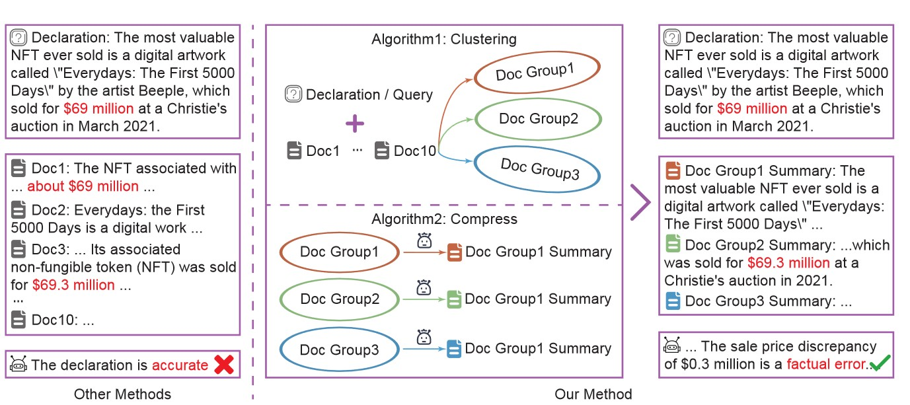

# EDC²-RAG: Efficient Dynamic Clustering-Based Document Compression for Retrieval-Augmented Generation


This repository contains the official implementation of **EDC²-RAG**, a plug-and-play document preprocessing framework that enhances Retrieval-Augmented Generation (RAG) by dynamically clustering and compressing retrieved documents. Our method improves the robustness, relevance, and factuality of LLM-based generation systems by leveraging fine-grained inter-document relationships.

## 🔍 Overview

Retrieval-Augmented Generation (RAG) enhances LLM outputs by integrating external documents. However, current RAG systems often suffer from **noise** and **redundancy** in the retrieved content.

**EDC²-RAG** addresses these issues via:

* 🔗 **Dynamic Clustering** of documents based on semantic similarity.
* ✂️ **Query-aware Compression** using LLMs to eliminate irrelevant or redundant content.
* 🧠 A more informative and coherent context for generation.



## 🚀 Features

* 📚 **Noise & Redundancy Reduction**: Fine-grained document-level structuring.
* 🧩 **Plug-and-Play**: No fine-tuning required, compatible with any retriever or LLM.
* ⚡ **Efficient**: Reduces hallucinations while minimizing inference overhead.
* 🧪 **Extensive Evaluation**: Verified across hallucination detection and QA tasks.

## 🧱 Architecture

1. **Document Retrieval**
   Standard retriever (e.g., DPR) fetches top-k documents.

2. **Dynamic Clustering**
   Documents are grouped based on similarity to the query and to each other, via an efficient iterative algorithm.

3. **LLM-based Compression**
   Each cluster is compressed using a query-specific prompt to retain only essential, verifiable information.

4. **Answer Generation**
   The compressed results are concatenated and passed to the LLM for final response generation.

## 📊 Experimental Results

| Dataset | Metric    | RALM  | Chunk Compression | EDC²-RAG (Ours) |
| ------- | --------- | ----- | ----------------- | --------------- |
| WebQ    | F1 Score  | 90.89 | 90.26             | **91.78**       |
| MusiQue | F1 Score  | 75.27 | 73.91             | **83.58**       |
| 2Wiki   | F1 Score  | 75.39 | 70.52             | **78.00**       |
| FELM    | Bal. Acc. | 58.18 | -----             | **62.26**       |

Our method demonstrates consistent gains in F1 and accuracy across varying levels of noise and redundancy. See the full report for ablation and robustness experiments.

## 🧪 Getting Started

### 1. Install Dependencies

```bash
pip install -r requirements.txt
```

### 2. Prepare Data

Download the raw datasets for the following three benchmarks: **Musique**, **TwoWiki**, and **WebQuestions**.

### 3. Evaluate Results

```bash
bash run.sh
```

The `run.sh` script performs the main evaluation pipeline. Specifically, it:

1. **Builds datasets** from raw files for Musique, TwoWiki, and WebQuestions.
2. **Runs evaluation** on each dataset using different top-k retrieval settings.

Before running the script, please make sure the following conditions are met:

* ✅ Your OpenAI API key is set correctly via the `OPENAI_API_KEY` environment variable.
* ✅ The embedding model required for retrieval has been deployed and is ready to use.
* ✅ The `[5,10,20,30,50,70,100]` list defines the **top-k** values for retrieval evaluation.
* ✅ The `[0]` list defines the **noise levels** (with `0` meaning no additional noise).
* ✅ You should **replace `date_here`** in `run.sh` with the actual date or any experiment tag to help organize and track results.

> Note: As of now, we only release the evaluation code and the datasets used in the main experiments. Code and data for ablation studies and hallucination detection will be released in the future. If you need access earlier, feel free to contact us.


